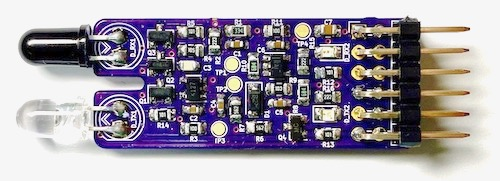

# IRTransceiver

A [Pmod](https://reference.digilentinc.com/reference/pmod/start) for emitting and receiving baseband IR signals.
It can be used to decode and emulate IR remote controls, IR communication or other IR-based sensors.

  

This module contains simple analog signal conditioning circuitry to connect a LED and a photodiode to FPGAs or microcontrollers.
The interface is a 12-pin Pmod (Spec B) with the following pinout:
* P1: TX, input, active high, controls the IR LED via a simple MOSFET.
* P2: GND
* P3: RX, output, is pulled high if the photodiode receives a stronger-than-average IR light.
* P4: GND
* P5, P11: GND (Pmod power supply pins)
* P6, P12: 3.3V (Pmod power supply pins)
* P7-P10: Not connected

The receiver contains a transimpedance amplifier, a high-pass filter and comparator to produce a clean digital signal.
The high-pass rejects ambient light along with signals slower than about 10 kHz, the usable bandwidth is about 100 kHz.
The receiver circuit was inspired by [IRis](https://github.com/devttys0/IRis).

## PYNQ Example Notebook

If you have a PYNQ-enabled FPGA-board, load [PYNQ_IR_Communication.ipynb](PYNQ_IR_Communication.ipynb) onto it to explore an example of sending and receiving IR signals.
This notebook works with the BaseOverlay and is completely self-contained not needing any additional drivers.
It expects an IRTransceiver connected to PMODA.